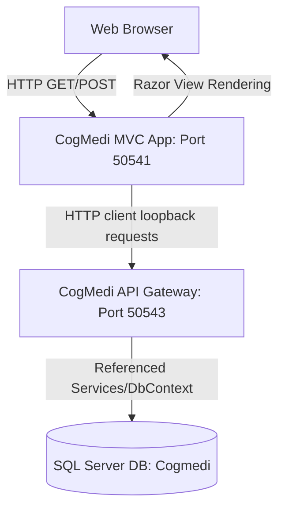

# Architecture Documentation

This document describes the design pattern, communications, and dependencies of the **CogMedi Hospital Management System** solution.

---

## 1. Decoupled MVC-API Architecture



---

## 2. Component Responsibilities

### MVC Web App
* **Authentication Proxy**: Collects user credentials, forwards authentication payloads to the login API, and sets the returned cookie locally on the client's browser.
* **HTTP Client Broker**: Custom HTTP requests executed through `BaseController` forward incoming browser authentication cookies directly to the Web API loopback.
* **Razor Views**: HTML UI template engine.

### Web API Gateway
* Exposes standard API controller routing (`/api/auth`, `/api/admin`, `/api/billing`, etc.).
* Standardized validation using ASP.NET Core model binding.
* Performs security checks using `[Authorize(Roles = "...")]` filters on incoming session cookies.

---

## 3. Project Reference Hierarchy

```text
[ CogMediHospitalManagementSystemApi.csproj ]
                      │
                      ▼ (ProjectReference)
[ CogMediHospitalManagementSystem.csproj (MVC) ]
                      │
                      ▼ (PackageReference)
[ Entity Framework Core (SQL Server) ]
```

---

## 4. Request / Response Lifecycle

1. **User Action**: The pharmacist dispenses a medicine by clicking "Hand Over" on the browser.
2. **MVC routing**: `PharmacistController.Dispense` action is triggered.
3. **Internal Gateway Call**: MVC executes `SendAsync` pointing to `https://localhost:50543/api/pharmacist/dispense/{id}` forwarding the browser's cookie.
4. **API Authentication & DB Access**: `PharmacistApiController.Dispense` intercepts the call, validates the role `"pharmacist"`, queries `HospitalDbContext`, modifies stock levels, and saves changes.
5. **Propagation**: API returns a HTTP 200 JSON payload back to the MVC controller, which updates the view model and redirects to render the updated UI grid.
