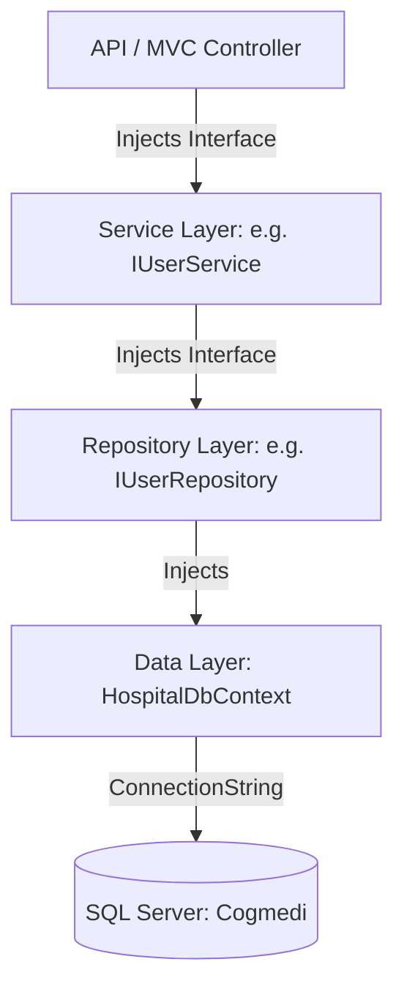

# Dependency Flow Documentation

This document maps the dependency injection (DI) flow from controllers down to the database layers of the **CogMedi Hospital Management System** solution.

---

## 1. Dependency Resolution Pipeline

Both projects configure their dependencies during application startup inside `Program.cs`.



---

## 2. Dependency Registrations

### A. Repositories
Repositories manage CRUD operations for entities:
* `IRepository<>` mapped to generic `Repository<>`
* `IUserRepository` mapped to `UserRepository`
* `IPatientRepository` mapped to `PatientRepository`
* `IAdmissionRepository` mapped to `AdmissionRepository`
* `IEhrRepository` mapped to `EhrRepository`
* `IOrderTestLabRepository` mapped to `OrderTestLabRepository`
* `ITreatmentPlanRepository` mapped to `TreatmentPlanRepository`
* `IPharmacyRepository` mapped to `PharmacyRepository`
* `IBillingRepository` mapped to `BillingRepository`
* `IDischargeRepository` mapped to `DischargeRepository`
* `IMedicineStockRepository` mapped to `MedicineStockRepository`

### B. Business Services
Services coordinate logical transactions and state rules:
* `IUserService` mapped to `UserService`
* `IPatientService` mapped to `PatientService`
* `IAdmissionService` mapped to `AdmissionService`
* `IEhrService` mapped to `EhrService`
* `IOrderTestLabService` mapped to `OrderTestLabService`
* `ITreatmentPlanService` mapped to `TreatmentPlanService`
* `IMedicineStockService` mapped to `MedicineStockService`
* `IPharmacyService` mapped to `PharmacyService`
* `IBillingService` mapped to `BillingService`
* `IDischargeService` mapped to `DischargeService`

---

## 3. Database Layer Resolution

* **DbContext**: `HospitalDbContext` is registered as a scoped dependency.
* **SQL Server**: Resolves the connection via the string named `MyConn` inside `appsettings.json`.
* **Migrations**: Executed automatically during startup in the MVC project to ensure schema stability:
  ```csharp
  context.Database.Migrate();
  DbInitializer.Initialize(context);
  ```
