# CogMedi Hospital Management System

[](https://dotnet.microsoft.com/)
[](https://www.microsoft.com/en-us/sql-server)
[](https://learn.microsoft.com/en-us/ef/core/)
[](https://learn.microsoft.com/en-us/aspnet/core/fundamentals/dependency-injection)
[](https://getbootstrap.com/)

> **A premium, state-of-the-art enterprise healthcare orchestration and operations portal designed to streamline admissions, treatments, diagnostics, pharmacy, billing, and system administration.**
>
> **Version:** 1.0.0
> **Technology Stack:** ASP.NET Core 10.0 MVC, Entity Framework Core 10.0.10, SQL Server

---

## 📖 Table of Contents

- [1. Project Overview](#1-project-overview)
- [2. Features](#2-features)
- [3. Technology Stack](#3-technology-stack)
- [4. Project Architecture](#4-project-architecture)
- [5. Folder Structure](#5-folder-structure)
- [6. Database Design](#6-database-design)
- [7. Entity Relationship Explanation](#7-entity-relationship-explanation)
- [8. Complete Workflow](#8-complete-workflow)
- [9. Module Flow](#9-module-flow)
- [10. Authentication Flow](#10-authentication-flow)
- [11. Role-Based Access Control (RBAC)](#11-role-based-access-control-rbac)
- [12. CRUD Flow](#12-crud-flow)
- [13. Request Lifecycle](#13-request-lifecycle)
- [14. Data Flow Diagram](#14-data-flow-diagram)
- [15. Flowcharts](#15-flowcharts)
- [16. Sequence Diagrams](#16-sequence-diagrams)
- [17. Activity Diagrams](#17-activity-diagrams)
- [18. Class Diagram](#18-class-diagram)
- [19. Project Execution Flow](#19-project-execution-flow)
- [20. Installation Guide](#20-installation-guide)
- [21. Configuration](#21-configuration)
- [22. Dependencies](#22-dependencies)
- [23. Security](#23-security)
- [24. Error Handling](#24-error-handling)
- [25. Screens and Navigation](#25-screens-and-navigation)
- [26. End-to-End User Journey](#26-end-to-end-user-journey)
- [27. Future Enhancements](#27-future-enhancements)
- [28. Conclusion](#28-conclusion)

---

## 1. Project Overview

### What the Project Is
The **CogMedi Hospital Management System** is a consolidated web application engineered to orchestrate workflows across all functional departments of a modern healthcare facility. It offers tailored portal environments for front desk staff, attending doctors, diagnostic lab technicians, pharmacists, billing cleared officers, and system administrators.

### Why It Was Built (Business & Existing Problem)
Before the implementation of CogMedi, the healthcare facility experienced administrative bottlenecks and data inconsistencies due to:
* **Fragmented Systems:** Patient registration, clinical documentation, laboratory orders, prescription tracking, and billing were managed in siloed systems, leading to high operational latency.
* **Manual Data Verification:** Staff frequently had to hand-carry paper sheets for lab requests and prescriptions, leading to transcription errors and delayed medical decisions.
* **Complex Billing Audits:** Reconciling room/bed charges, physician fees, lab test rates, and dispensed drugs manually at the point of discharge was error-prone, causing billing delays or revenue leakage.
* **Security & Audits Risks:** Lack of structured role restrictions made it difficult to secure sensitive Patient Health Information (PHI) and track user modifications.

### Proposed Solution
CogMedi acts as a single centralized system to coordinate the patient journey:
* **Central Database Registry:** All patient information, admissions history, lab orders, pharmacy dispenses, and invoices are managed within a unified SQL Server database using Entity Framework Core.
* **Direct Clinical Workflows:** A doctor's diagnosis automatically initiates laboratory order entries for technicians and prescription orders in the pharmacist's dispensary queue.
* **Automated Accounting Engine:** The system aggregates flat consultation fees (₹500), flat room/bed charges (₹1,500 for admitted status), lab test rates (₹800 per test), and stock-based pharmacy prices automatically at discharge.
* **Claim-Based Authentication:** Multi-portal security limits views and actions to authorized roles.

### Objectives & Scope
* Eliminate paper-based transactions.
* Build an automated billing and invoice engine.
* Establish strict Role-Based Access Control (RBAC).
* Provide data visualization dashboards for administrative and operational monitoring.

### Benefits
* Reduced patient waiting times at the front desk and billing counters.
* Minimized data entry errors via real-time prescription and diagnostic order syncing.
* Reliable bed inventory tracking.
* Accurate, audit-ready financial reporting.

---

## 2. Features

### 🔐 1. Authentication & Gateways Module
* **Unified Login Gateways:** Separate forms for Admin, Receptionist, Doctor, Lab Technician, Pharmacist, and Billing Officer.
* **Claims-Based Session:** Encrypted cookie validation stores identity details (`Id`, `Username`, `Role`, `FullName`) with a rolling 2-hour timeout.
* **Auto-Provisioning Backdoor:** Entering an empty username triggers auto-creation of default user records (e.g., `admin`, `receptionist`, `Doctor Ramesh`) with the default password `password` for rapid deployment and testing.

### 📊 2. Administrator Module
* **Executive Dashboard:** Live metrics monitoring total system patients, admitted stays, doctor counts, cumulative revenue, and lab volumes.
* **Staff Register Management:** Hire new personnel across receptionist, laboratory, pharmacist, and billing roles, or remove them from the system.
* **Physician Recruitment:** Register doctors, select specialties (e.g., Cardiology, Pediatrics, Neurology, Orthopedics), input professional biographies, and assign custom system credentials.

### 📋 3. Receptionist Module (Front Desk Desk)
* **Patient Registration:** Register patients, capture demographic data (Name, Age, Gender, Address, Contact details) with validations ensuring `Age > 0`.
* **Bed Allocation & Admissions:** Admit patients, select wards (e.g., General Ward, ICU), assign beds, and assign an active doctor.
* **Admission History:** Track stay records, bed occupancy lists, and patient profiles.

### 🩺 4. Doctor Module (Physician Portal)
* **Active Queue:** Monitor admitted patients assigned directly to the logged-in doctor.
* **EHR Records Entry:** Log clinical notes and diagnoses. Saves records to the database and redirects the physician to order lab tests.
* **Lab Order Entry:** Request laboratory analyses (e.g., CBC Test, Chest X-Ray, Blood Glucose) for a patient.
* **Specialty Prescriptions:** Prescribe medicines selected dynamically based on the physician's specialty department (Cardiology, Pediatrics, Neurology, Orthopedics, or General Medicine).
* **Profile Management:** Update specialty details, bios, email addresses, and contact numbers.

### 🧪 5. Laboratory Module (Diagnostic Lab Unit)
* **Lab Request Queue:** Centralized tracker displaying all laboratory test orders.
* **State Machine Tracking:** Manage tests transitioning from `ORDERED` to `IN_PROGRESS` (when the sample is collected) and finally to `COMPLETED` (when findings are submitted).
* **Findings Upload:** Input result values (e.g., *"Inflamed appendix observed"*) and tag the active technician.

### 💊 6. Pharmacy Module (Dispensary)
* **Live Prescription Sync:** Prescriptions written by doctors in treatment plans automatically queue in the dispensary list.
* **Inventory Control:** Monitor medicine stocks. Pharmacists can restock medicines or adjust quantities.
* **Safe Dispensing Check:** Automatically checks stock levels. Prevents dispensing if the request exceeds available stock. Updates database inventory quantities on successful dispensing.

### 💳 7. Billing & Discharge Module
* **Dynamic Fee Aggregator:** Automatically calculates:
  * *Consultation Fee:* Flat ₹500.
  * *Room Charges:* Flat ₹1,500 if the patient was admitted to a ward.
  * *Lab Charges:* Flat ₹800 per ordered lab test.
  * *Medicine Charges:* Sum of (`Price Per Unit` * `Quantity`) for all dispensed drugs.
* **Payment Processing Gateway:** Supports CASH, UPI, and CARD payments. Collects custom metadata (e.g., UPI IDs, Card digits, cash tendered) and generates unique transaction numbers (e.g., `TXN20260731XXXXXX`).
* **Invoice Generator:** Printable receipts showing itemized charges, payment details, and hospital headers.
* **Discharge Clearance:** Enforces a "payment before discharge" rule. Patients can only be marked as `DISCHARGED` once their invoice status is `PAID`.

### 📈 8. Reports & Analytics Module
* **Financial Analytics:** Line chart representing monthly revenue changes over the last 6 months.
* **Department Utilization:** Pie chart displaying patient admission numbers per ward (ICU vs. General Ward).
* **Diagnostic Volume Logs:** Bar charts displaying volume summaries per lab test category.
* **Revenue Feed:** Live feed of the latest paid invoices and ward occupancy counts.

---

## 3. Technology Stack

* **ASP.NET Core 10.0 MVC:** Powers the presentation and routing layers using controllers, models, and Razor CSHTML views.
* **Entity Framework (EF) Core 10.0.10:** Implements Object-Relational Mapping (ORM) to handle all database operations, migrations, and relationships.
* **SQL Server:** The production-grade relational database management system. Includes a local fallback connection string for Developer Express instances.
* **Bootstrap 5 & Vanilla CSS:** Modular stylesheets (e.g., `layout.css`, `theme.css`, `sidebar.css`) provide responsive styling and CSS grid/flex layouts.
* **Vanilla JavaScript:** Powers the search bar, payment forms, inventory adjustments, and billing calculations.
* **Repository Pattern:** Implements generic `Repository<T>` and specialized repositories to decouple data access from business logic.
* **ASP.NET Core Cookie Authentication Middleware:** Provides secure authentication without requiring external identity provider dependencies.

---

## 4. Project Architecture

The application is structured using a decoupled N-Tier architecture:

```
[ Presentation Layer (Razor Views / JS / CSS / Browser) ]
                           │  ▲
                           ▼  │ (HTTP Request / Response)
     [ Controllers (MVC Controllers & REST API Services) ]
                           │  ▲
                           ▼  │ (Service Layer Interfaces)
          [ Service Layer (Business Rule Orchestrators) ]
                           │  ▲
                           ▼  │ (Repository Layer Interfaces)
       [ Repository Layer (Generic & Specialized Databases) ]
                           │  ▲
                           ▼  │ (Entity Operations)
    [ Entity Framework Core (DbContext / DB Sets / Mappings) ]
                           │  ▲
                           ▼  │ (ADO.NET SQL Queries)
                    [ SQL Server Database ]
```

### Data Movement Workflow
1. **Request Phase:** The user performs an action (e.g., clicks "Dispense Medicine"). The browser triggers a POST request to `PharmacistController.Dispense(recordId)`.
2. **Controller Phase:** The controller extracts the pharmacist's name from claims and passes the request to `PharmacyService`.
3. **Business/Service Phase:** `PharmacyService` queries the active prescription record. It calls `MedicineStockService` to verify available stock.
4. **Data Phase:** If stock is available, the service calls `PharmacyRepository` and `MedicineStockRepository` to update entity states.
5. **Database Phase:** EF Core translates the modifications into SQL commands (`UPDATE PharmacyRecords ...; UPDATE MedicineStocks ...;`), executing them inside a database transaction.
6. **Response Phase:** The repository saves changes, the service confirms execution, and the controller redirects to `/pharmacist/dispensing` with a success alert.

---

## 5. Folder Structure

Below is the directory tree of the `myNewRepo` project workspace:

```
myNewRepo/
├── CogMediHospitalManagementSystem.csproj  # Target framework & NuGet packages
├── CogMediHospitalManagementSystem.slnx    # XML-based visual solution file
├── Program.cs                              # Startup logic, DI, and middleware pipelines
├── appsettings.json                        # SQL Server connection string configurations
│
├── Data/                                   # Database Access layer
│   ├── HospitalDbContext.cs                # DbContext defining database entities
│   └── DbInitializer.cs                    # Self-healing database seed data
│
├── Models/                                 # Database Model entities
│   ├── User.cs                             # System users, roles, and profiles
│   ├── Patient.cs                          # Patient records, wards, and beds
│   ├── Admission.cs                        # Ward allocations and doctor logs
│   ├── EhrRecord.cs                        # Electronic Health Records
│   ├── OrderTestLab.cs                     # Lab orders saved to database
│   ├── LabOrder.cs                         # View Model representation of lab orders
│   ├── TreatmentPlan.cs                    # Diagnoses, prescriptions, and instructions
│   ├── PharmacyRecord.cs                   # Medicine prescription logs
│   ├── MedicineStock.cs                    # Live stock inventory quantities & prices
│   ├── BillingRecord.cs                    # Payments and discharge flags
│   └── DischargeRecord.cs                  # Clinical summaries at discharge
│
├── Enums/                                  # Strong type configurations
│   ├── UserRole.cs                         # admin, receptionist, doctor, laboratory, etc.
│   ├── PatientStatus.cs                    # REGISTERED, ADMITTED, DISCHARGED
│   ├── AdmissionStatus.cs                  # ADMITTED, DISCHARGED
│   ├── LabOrderStatus.cs                   # ORDERED, IN_PROGRESS, COMPLETED
│   ├── PharmacyRecordStatus.cs             # PENDING, DISPENSED
│   ├── BillingStatus.cs                    # PENDING, PAID
│   └── GenderType.cs                       # Male, Female, Other
│
├── Repositories/                           # Data access abstraction
│   ├── interface/                          # Data access interfaces (IRepository, IUserRepository)
│   └── implementation/                     # EF Core repositories (Repository, UserRepository)
│
├── Services/                               # Business logic layer
│   ├── interface/                          # Service interfaces (IPatientService, IBillingService)
│   └── implementation/                     # Business rule services (PatientService, BillingService)
│
├── ViewModels/                             # View-specific data containers
│   ├── LoginViewModel.cs                   # Login credentials container
│   ├── DashboardViewModel.cs               # Live numbers for role dashboards
│   ├── PatientViewModel.cs                 # Front-desk patient details
│   ├── RegisterViewModel.cs                # System administrator registry
│   ├── BillingViewModel.cs                 # Invoices, room fees, and payment modes
│   └── ReportViewModel.cs                  # Analytical report data
│
├── DTOs/                                   # Data Transfer Objects & Mappers
│   ├── PatientDto.cs                       # Patient schemas for API endpoints
│   ├── UserDto.cs                          # User schemas for API endpoints
│   └── MappingExtensions.cs                # Extension methods for DTO-Entity translation
│
├── Views/                                  # HTML Razor layout pages
│   ├── Home/                               # Landing portals and search forms
│   ├── Auth/                               # Login views per role
│   ├── Admin/                              # User registries and admin dashboard
│   ├── Receptionist/                       # Registration, bed allocation, admissions
│   ├── Doctor/                             # Active cases, EHR, lab orders, prescriptions
│   ├── Lab/                                # Lab queues and diagnostic logs
│   ├── Pharmacist/                         # Dispensary lists and inventory logs
│   ├── Billing/                            # Dynamic invoice grids and payment gateways
│   ├── Reports/                            # Chart integrations
│   ├── Settings/                           # Hospital and password configurations
│   └── Shared/                             # Page templates and partial views
│
└── wwwroot/                                # CSS, JavaScript, and asset folders
    ├── css/                                # Module-specific stylesheets
    ├── js/                                 # Page scripts and payment handlers
    └── images/                             # Background image assets
```

---

## 6. Database Design

The database design uses Entity Framework Core foreign keys to enforce relational integrity:

### 1. `Users` Table
* **Purpose:** Stores user profiles, credentials, and medical practitioner details.
* **PrimaryKey:** `Id` (INT, Identity)
* **Columns:** `Username` (NVARCHAR(50)), `Role` (NVARCHAR(50)), `FullName` (NVARCHAR(100)), `Password` (NVARCHAR(100)), `DoctorUniqueId` (NVARCHAR(20), Nullable), `Specialty` (NVARCHAR(100)), `Biography` (NVARCHAR(500)), `ContactNumber` (NVARCHAR(20)), `Email` (NVARCHAR(100)).
* **Navigation Properties:** Relates to `Patient.AssignedDoctor`, `Admission.AssignedDoctor`, `EhrRecord.Doctor`, and `TreatmentPlan.Doctor`.

### 2. `Patients` Table
* **Purpose:** Stores patient demographic data and current clinical status.
* **PrimaryKey:** `PatientId` (INT, Identity)
* **Columns:** `Name` (NVARCHAR(100)), `Age` (INT), `Gender` (NVARCHAR(20)), `Address` (NVARCHAR(250)), `ContactNumber` (NVARCHAR(20)), `Status` (NVARCHAR(30)), `CreatedDate` (DATETIME), `AssignedDoctorId` (INT, FK), `AssignedDoctorName` (NVARCHAR(100)), `Ward` (NVARCHAR(100)), `BedNumber` (NVARCHAR(50)).
* **Navigation Properties:** `AssignedDoctor` (User).

### 3. `Admissions` Table
* **Purpose:** Records ward assignments, bed numbers, and physician metrics during inpatient stays.
* **PrimaryKey:** `AdmissionId` (INT, Identity)
* **Columns:** `PatientId` (INT, FK), `PatientName` (NVARCHAR(100)), `Age` (INT), `AdmissionDate` (DATETIME), `DischargeDate` (DATETIME, Nullable), `Ward` (NVARCHAR(50)), `BedNumber` (NVARCHAR(20)), `Status` (NVARCHAR(30)), `AssignedDoctorId` (INT, FK), `AssignedDoctorName` (NVARCHAR(100)).
* **Navigation Properties:** `Patient` (Patient), `AssignedDoctor` (User).

### 4. `EhrRecords` Table
* **Purpose:** Stores doctor notes, visit logs, and diagnoses.
* **PrimaryKey:** `EhrId` (INT, Identity)
* **Columns:** `PatientId` (INT, FK), `PatientName` (NVARCHAR(100)), `DoctorId` (INT, FK), `DoctorName` (NVARCHAR(100)), `Diagnosis` (NVARCHAR(250)), `DoctorNotes` (NVARCHAR(2000)), `VisitDate` (DATETIME).
* **Navigation Properties:** `Patient` (Patient), `Doctor` (User).

### 5. `OrderTestLabs` Table
* **Purpose:** Tracks laboratory orders, diagnostic results, and assigned technicians.
* **PrimaryKey:** `LabOrderId` (INT, Identity)
* **Columns:** `PatientId` (INT, FK), `PatientName` (NVARCHAR(100)), `DoctorId` (INT, Nullable), `DoctorName` (NVARCHAR(100), Nullable), `TestName` (NVARCHAR(150)), `Status` (NVARCHAR(50)), `OrderDate` (DATETIME), `Result` (NVARCHAR(2000), Nullable), `TechnicianName` (NVARCHAR(100), Nullable).
* **Navigation Properties:** `Patient` (Patient).

### 6. `TreatmentPlans` Table
* **Purpose:** Stores prescriptions and instructions issued by doctors.
* **PrimaryKey:** `TreatmentPlanId` (INT, Identity)
* **Columns:** `PatientId` (INT, FK), `PatientName` (NVARCHAR(100)), `DoctorId` (INT, FK), `DoctorName` (NVARCHAR(100)), `Diagnosis` (NVARCHAR(250)), `TreatmentDescription` (NVARCHAR(1000)), `Medication` (NVARCHAR(500)), `Duration` (NVARCHAR(100)), `Instructions` (NVARCHAR(500)), `PrescribedDate` (DATETIME), `OrderTest` (NVARCHAR(100), Nullable).
* **Navigation Properties:** `Patient` (Patient), `Doctor` (User).

### 7. `PharmacyRecords` Table
* **Purpose:** Logs prescriptions awaiting processing or dispensed by pharmacists.
* **PrimaryKey:** `PharmacyRecordId` (INT, Identity)
* **Columns:** `PatientId` (INT, FK), `PatientName` (NVARCHAR(100)), `TreatmentPlanId` (INT, FK, Nullable), `MedicineName` (NVARCHAR(100)), `Quantity` (INT), `Status` (NVARCHAR(30)), `DispensedDate` (DATETIME, Nullable), `PharmacistName` (NVARCHAR(100)).
* **Navigation Properties:** `Patient` (Patient), `TreatmentPlan` (TreatmentPlan).

### 8. `BillingRecords` Table
* **Purpose:** Tracks patient invoices, payment modes, and discharge clearance flags.
* **PrimaryKey:** `BillingRecordId` (INT, Identity)
* **Columns:** `PatientId` (INT, FK), `PatientName` (NVARCHAR(100)), `ConsultationFee` (DECIMAL(18,2)), `LabCharges` (DECIMAL(18,2)), `MedicineCharges` (DECIMAL(18,2)), `RoomCharges` (DECIMAL(18,2)), `TotalAmount` (Calculated, readonly property: `ConsultationFee + LabCharges + MedicineCharges + RoomCharges`), `Status` (NVARCHAR(30)), `CreatedDate` (DATETIME), `PaymentDate` (DATETIME, Nullable), `PaymentMethod` (NVARCHAR(50)), `TransactionId` (NVARCHAR(100)), `IsDischarged` (BIT), `DischargeDate` (DATETIME, Nullable), `DischargeRemarks` (NVARCHAR(500)).
* **Navigation Properties:** `Patient` (Patient).

### 9. `DischargeRecords` Table
* **Purpose:** Archive table preserving clinical summaries and stay durations.
* **PrimaryKey:** `DischargeRecordId` (INT, Identity)
* **Columns:** `PatientId` (INT, FK), `PatientName` (NVARCHAR(100)), `AdmissionDate` (DATETIME), `DischargeDate` (DATETIME), `Remarks` (NVARCHAR(500)), `Summary` (NVARCHAR(2000)).
* **Navigation Properties:** `Patient` (Patient).

### 10. `MedicineStocks` Table
* **Purpose:** Inventory register tracking quantities and unit pricing.
* **PrimaryKey:** `MedicineStockId` (INT, Identity)
* **Columns:** `MedicineName` (NVARCHAR(100)), `Quantity` (INT), `Price` (DECIMAL(18,2)).
* **Navigation Properties:** None.

---

## 7. Entity Relationship Explanation

The database design uses Entity Framework Core foreign keys to enforce relational integrity:

* **One-to-Many:**
  * `User` (Doctor) -> `Patient`: A doctor is assigned to coordinate the care of multiple patients.
  * `User` (Doctor) -> `Admission`: A doctor is mapped to monitor multiple admissions.
  * `User` (Doctor) -> `EhrRecord`: A doctor records multiple health logs.
  * `User` (Doctor) -> `TreatmentPlan`: A doctor issues multiple treatment plans.
  * `Patient` -> `Admission` / `EhrRecord` / `OrderTestLab` / `TreatmentPlan` / `PharmacyRecord` / `BillingRecord` / `DischargeRecord`: The central patient file has multiple historical records across all tables.

* **One-to-One / Pseudo One-to-One:**
  * `TreatmentPlan` -> `PharmacyRecord`: Although modeled as a foreign key on `PharmacyRecord` (One-to-Many), it functions as a One-to-One relationship where a specific treatment plan maps directly to the prescription record for dispensing.

> [!NOTE]
> `MedicineStock` is not linked to other tables via foreign keys. This design choice prevents deletion issues when cleaning up old transaction files, instead using name-based lookups to fetch prices.

---

## 8. Complete Workflow

```
Application Starts (Program.cs)
        │
        ▼
Dependency Injection (Register DbContext, Services, & Repositories)
        │
        ▼
Configure Middleware Pipeline (StaticFiles, Routing, Cookie Auth)
        │
        ▼
Self-Healing Seed Execution (DbInitializer migrates and seeds data)
        │
        ▼
Authentication Check (Evaluate authorization policies)
        │
        ▼
Controller Action Routing (Match URL pattern to action method)
        │
        ▼
Service Logic Execution (Query DB via Repository Layer)
        │
        ▼
HTML/Razor Page Compilation (Generate HTML view response)
        │
        ▼
Browser Render (Load resources and bind event scripts)
```

### Workflow Phase Descriptions
1. **Application Starts:** Kestrel initializes the web host and builds the pipeline.
2. **Dependency Injection:** Registers generic repositories `IRepository<>` and custom services (e.g., `IBillingService`) into the service collection.
3. **Middleware:** Standard filters process request headers. Access requests must pass the `UseAuthentication` and `UseAuthorization` checkpoints.
4. **Self-Healing Seed Execution:** On startup, the host runner calls `context.Database.Migrate()` to execute schema updates. It then calls `DbInitializer.Initialize` to auto-provision stock items, users, and default accounts.
5. **Authentication Check:** The system verifies the user's cookie. If the cookie is expired or missing, it redirects the user to the landing portal `/`.
6. **Controller Action Routing:** The endpoint router matches route parameters (e.g., `/doctor/dashboard`) to activate the controller.
7. **Service Logic Execution:** The controller queries database entities using registered services, translating logic models into ViewModels.
8. **HTML/Razor Page Compilation:** Razor views merge the compiled model structure into HTML, sending the response to the user's browser.

---

## 9. Module Flow

Every system module utilizes a structured data processing pipeline:

### 1. Patient Registration Flow
```
Register Button Click (Admission page)
        │
        ▼
Demographics Input (Name, Age, Gender, Contact)
        │
        ▼
Server-Side Check (Enforce Age > 0 validation)
        │
        ▼
PatientService.RegisterPatient (Save entity state)
        │
        ▼
DB Insert (Insert record into Patients table)
        │
        ▼
Redirect to Admission Page (Display registry updates)
```

### 2. Clinical EHR Entry Flow
```
Patient Queue Select (Doctor Dashboard)
        │
        ▼
Diagnosis & Clinical Notes Entry (Add EHR form)
        │
        ▼
EhrService.CreateEhr (Associates DoctorId & DoctorName)
        │
        ▼
DB Insert (Insert record into EhrRecords table)
        │
        ▼
Redirect to Lab Order Desk (Prompt for diagnostic requests)
```

### 3. Lab Test Workflow
```
Select Diagnostics tests (Doctor order form)
        │
        ▼
OrderTestLabService.CreateOrderTestLab (Status set to ORDERED)
        │
        ▼
Technician starts test (Lab orders page; status set to IN_PROGRESS)
        │
        ▼
Technician uploads findings (Input test results; status set to COMPLETED)
        │
        ▼
DB Update (Save results string to OrderTestLabs table)
```

### 4. Pharmacy Dispensary Flow
```
Treatment Plan saves (Medication list parsed)
        │
        ▼
Auto-Create Pharmacy Records (Prescription status set to PENDING)
        │
        ▼
Pharmacist processes order (Check stock availability)
        │
        ▼
Deduct medicine stock (Update MedicineStocks inventory count)
        │
        ▼
PharmacyService.DispenseMedicine (Status updated to DISPENSED)
```

### 5. Automated Billing & Discharge Flow
```
Billing dashboard select (Verify patient billing profile)
        │
        ▼
Compile Fees (Consultation [500] + Room [1500 if admitted] + Lab [800/test] + Drugs)
        │
        ▼
Collect Invoice Payment (Settle payment via CASH, CARD, or UPI)
        │
        ▼
Update Invoice status (Set BillingRecords status to PAID)
        │
        ▼
Discharge clearance check (Verify payment status is PAID)
        │
        ▼
DischargeService.DischargePatient (Set Patient status to DISCHARGED)
```

---

## 10. Authentication Flow

```
User visits / 
        │
        ▼
Portal gateway select (Admin, Recep, Doctor, Lab, Pharm, Billing)
        │
        ▼
Input credentials (Username & Password)
        │
        ▼
ValidateUser Service check (Evaluate credentials matching role)
        │
        ├─► [Invalid] ──► Display validation error message
        │
        └─► [Valid] ───► Get user profile from DB
                            │
                            ▼
                         Generate security claims (Name, Role, ID)
                            │
                            ▼
                         Issue encrypted Cookie (Set rolling 2-hour timeout)
                            │
                            ▼
                         Redirect to Role Dashboard
```

> [!IMPORTANT]
> The system includes a self-healing auto-provisioning system. If the login username is left blank, the system automatically checks for and seeds a default user for that role in the database.

---

## 11. Role-Based Access Control (RBAC)

Access control rules are configured using MVC action filters. Below are the responsibilities and access levels for each role:

### 1. System Administrator (`admin`)
* **Responsibilities:** Manage user profiles, recruit doctors, register clinical staff, and view analytics.
* **Access Paths:** `/admin/*`, `/reports/*`, `/settings/*`.
* **Restricted Paths:** Medical records entry, drug dispensing, or bed allocations.

### 2. Front Desk Receptionist (`receptionist`)
* **Responsibilities:** Manage patient registrations, edit patient demographics, assign wards/beds, and assign consulting doctors.
* **Access Paths:** `/receptionist/*`, `/api/search`.
* **Restricted Paths:** Staff hiring, clinical diagnostics, medicine dispensing, and billing.

### 3. Attending Physician (`doctor`)
* **Responsibilities:** View assigned patients, log EHR clinical notes, order laboratory tests, prescribe medications, and update doctor profiles.
* **Access Paths:** `/doctor/*`.
* **Restricted Paths:** Restocking pharmacy inventory, hiring staff, processing payments, and discharging patients.

### 4. Lab Technician (`laboratory`)
* **Responsibilities:** Monitor test requests, update test status to `IN_PROGRESS`, and upload diagnostic findings.
* **Access Paths:** `/lab/*`.
* **Restricted Paths:** Registration desk, clinical prescriptions, inventory management, and billing.

### 5. Pharmacist (`pharmiacist`)
* **Responsibilities:** Dispense medications, manage inventory stock, and restock supplies.
* **Access Paths:** `/pharmacist/*`.
* **Restricted Paths:** Clinical diagnostic decisions, patient admissions, and billing.
* **Code Notation:** The role is spelled `"pharmiacist"` in the source code validation filters.

### 6. Billing Officer (`billing discharge`)
* **Responsibilities:** Generate billing invoices, process payments, print receipts, and clear patients for discharge.
* **Access Paths:** `/billing/*`, `/reports`.
* **Restricted Paths:** Clinical notes entry, diagnostic testing, and pharmacy restocking.
* **Code Notation:** The role is spelled `"billing discharge"` in the source code.

---

## 12. CRUD Flow

```
Browser View Form ──► Controller Endpoint ──► Service Layer ──► Repository ──► SQL Database
      ▲                                                                            │
      └────────────────────────── Response Payload ────────────────────────────────┘
```

* **Create:**
  * *UI:* Receptionist submits the Patient Registration form.
  * *Controller:* Validates fields. Passes a `Patient` entity to `IPatientService`.
  * *Repository:* Calls `IRepository<Patient>.Add()`.
  * *EF Core & DB:* Translates to `INSERT INTO Patients ...` and returns the database-generated ID.
* **Read:**
  * *UI:* Doctor loads their active admitted patient queue.
  * *Controller:* Queries the database by doctor ID.
  * *Repository:* Calls `Find()` with an active status condition filter.
  * *EF Core & DB:* Translates to `SELECT * FROM Patients WHERE AssignedDoctorId = X AND Status = 'ADMITTED'`.
* **Update:**
  * *UI:* Pharmacist updates medicine stock.
  * *Controller:* Passes the medicine name and adjustment value to `IMedicineStockService`.
  * *Repository:* Fetches the entity, adjusts the quantity, and calls `Update()`.
  * *EF Core & DB:* Translates to `UPDATE MedicineStocks SET Quantity = Y WHERE MedicineStockId = Z`.
* **Delete:**
  * *UI:* Admin clicks "Remove Staff" on the registry page.
  * *Controller:* Passes the user ID to `IUserService`.
  * *Repository:* Calls `Delete()`.
  * *EF Core & DB:* Translates to `DELETE FROM Users WHERE Id = X`.

---

## 13. Request Lifecycle

The processing lifecycle of an HTTP request:

```
[ HTTP Request (Browser) ]
            │
            ▼
[ Middleware Pipeline (Auth, Routing, CORS) ]
            │
            ▼
[ Controller Selection & Dependency Injection ]
            │
            ▼
[ Model Binding & State Validation ]
            │
            ├─► [Validation Fails] ──► Re-render form with error tags
            │
            └─► [Validation Passes] ─► Execute Controller Action Method
                                                │
                                                ▼
                                       Service Business Logic Processing
                                                │
                                                ▼
                                       Repository Database Update (EF Core)
                                                │
                                                ▼
                                       Save Changes inside DB Transaction
                                                │
                                                ▼
                                       Razor View Engine renders HTML view
                                                │
                                                ▼
                                       [ HTTP Response (Browser) ]
```

---

## 14. Data Flow Diagram

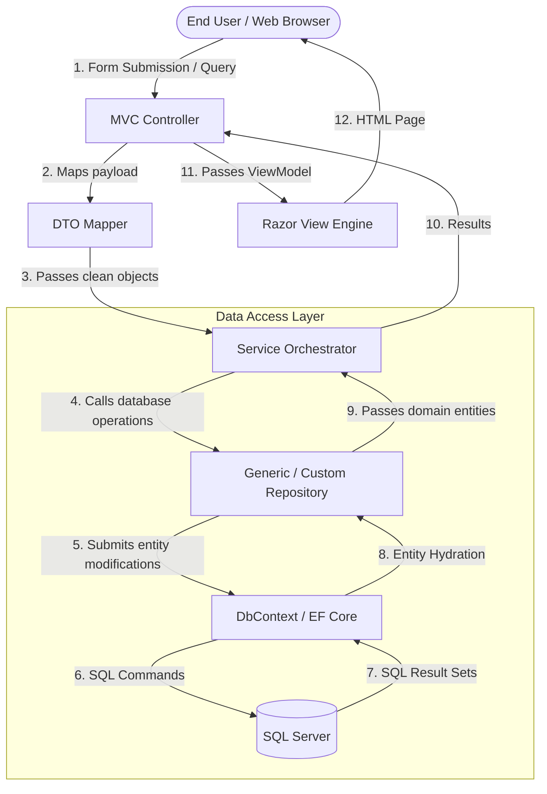

---

## 15. Flowcharts

### 1. Application Startup Flow
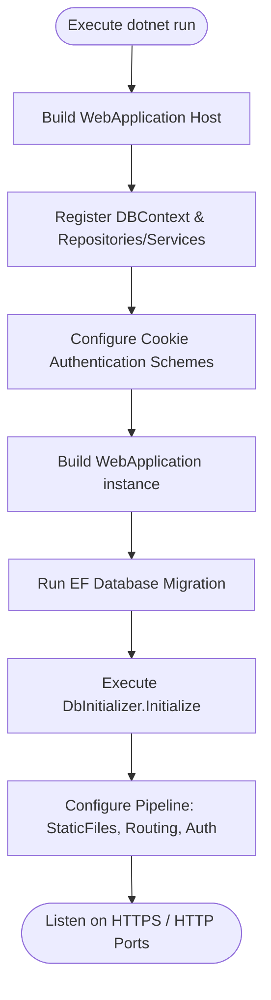

### 2. Login Flow
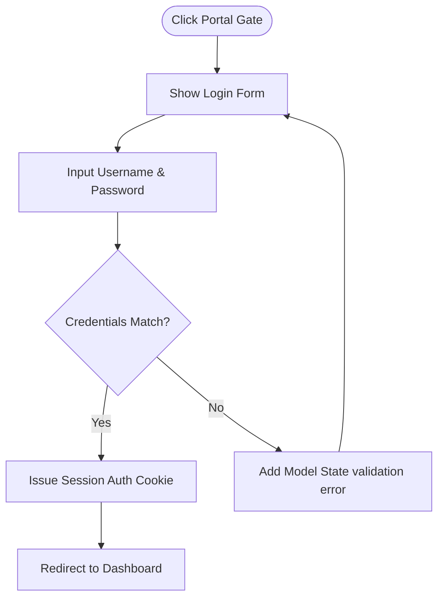

### 3. Patient Registration Flow
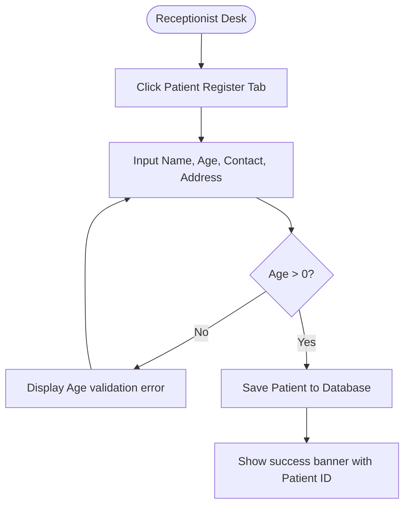

### 4. Admission & Bed Allocation Flow
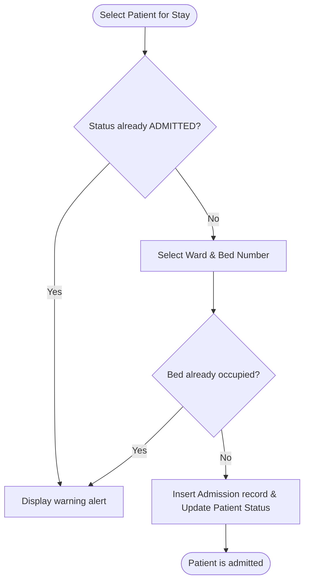

### 5. Laboratory Testing Flow
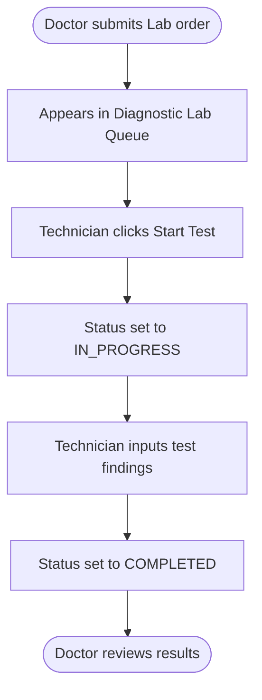

### 6. Pharmacy Dispensary Flow
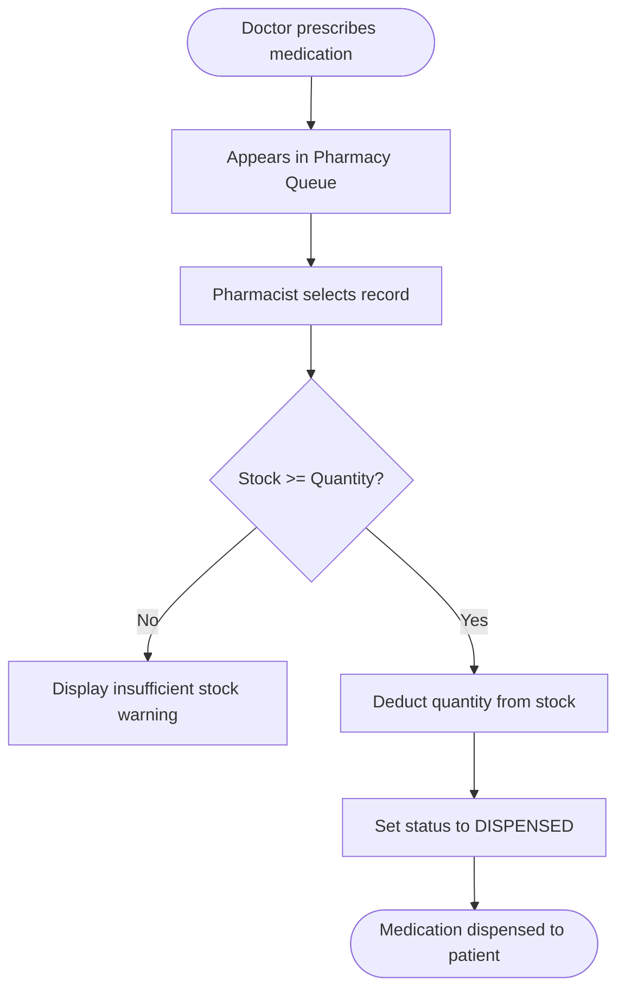

### 7. Billing & Payment Flow
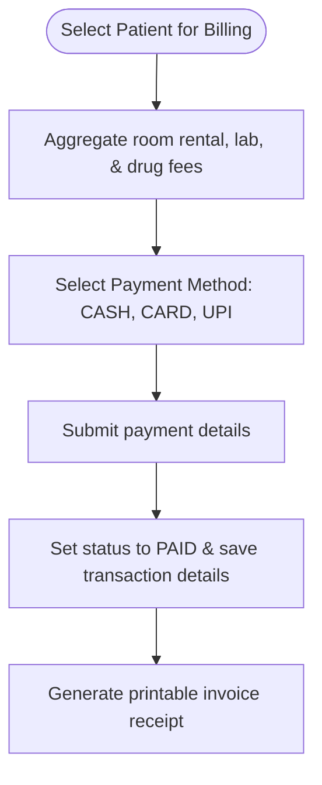

### 8. Patient Discharge Flow
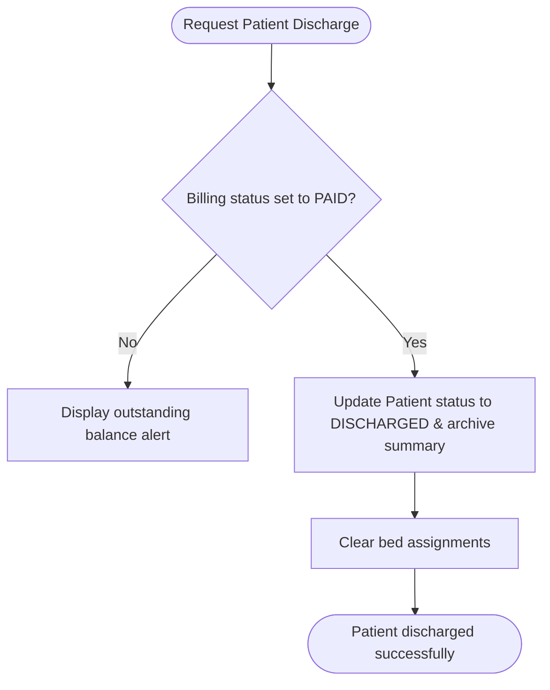

### 9. Admin Operations Flow
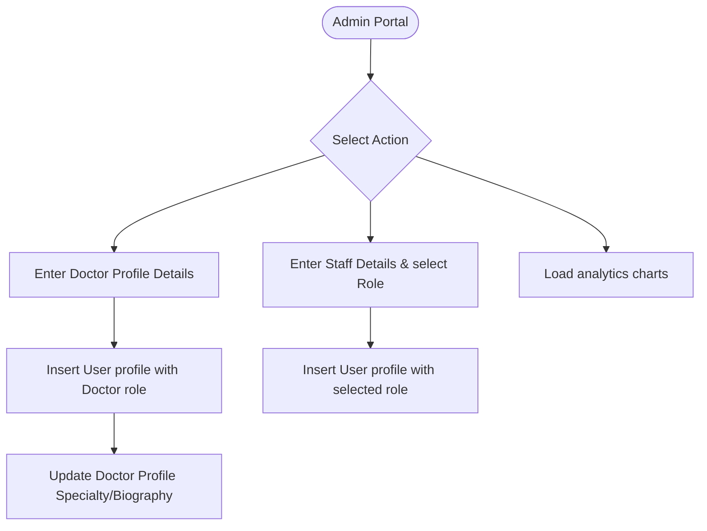

### 10. Repository Flow
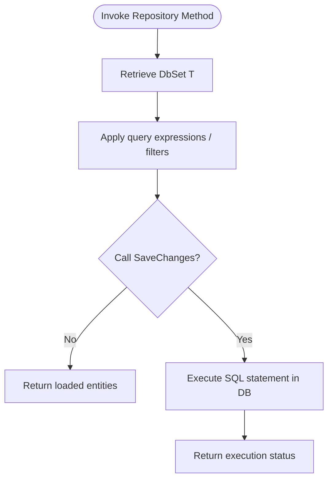

### 11. Controller Flow
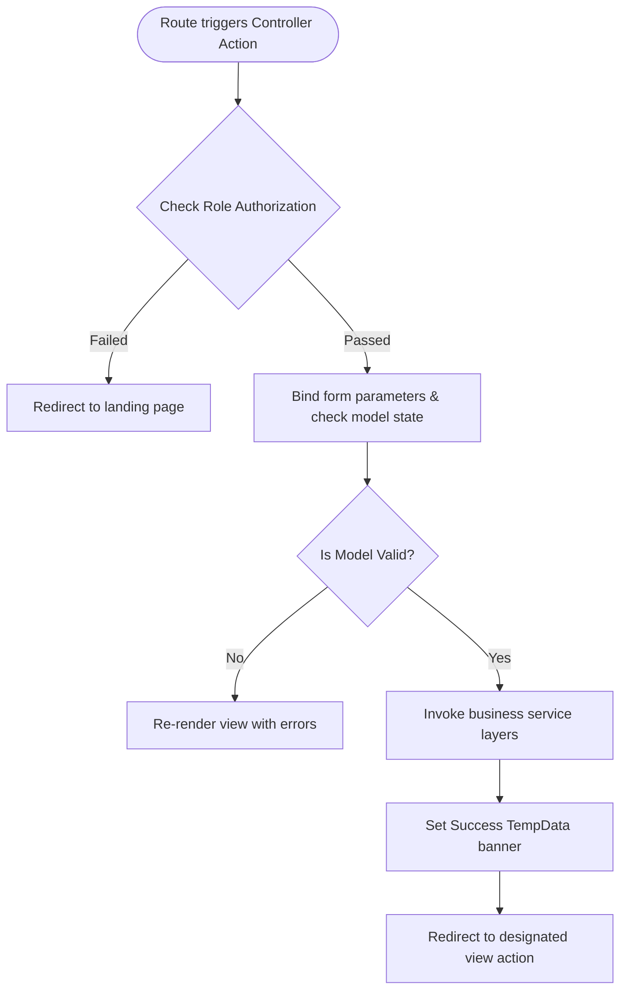

---

## 16. Sequence Diagrams

### 1. Front Desk Patient Registration & Admission
```mermaid
sequenceDiagram
    autonumber
    actor Recep as Receptionist
    participant UI as Admission View
    participant Ctrl as Receptionist Controller
    participant Svc as Patient & Admission Services
    participant DB as SQL Database

    Recep->>UI: Enter patient details (Register form)
    activate UI
    UI->>Ctrl: POST /receptionist/register
    deactivate UI
    activate Ctrl
    Ctrl->>Svc: RegisterPatient(patient)
    activate Svc
    Svc->>DB: INSERT INTO Patients
    activate DB
    DB-->>Svc: Success (PatientId generated)
    deactivate DB
    Svc-->>Ctrl: Success
    deactivate Svc
    Ctrl-->>Recep: Re-render with success alert
    deactivate Ctrl

    Recep->>UI: Enter ward details, bed allocation, & DoctorId (Admit form)
    activate UI
    UI->>Ctrl: POST /receptionist/admit
    deactivate UI
    activate Ctrl
    Ctrl->>Svc: AdmitPatient(patientId, ward, bed, doctorId)
    activate Svc
    Svc->>DB: INSERT INTO Admissions; UPDATE Patients Status = ADMITTED
    activate DB
    DB-->>Svc: Success
    deactivate DB
    Svc-->>Ctrl: Success
    deactivate Svc
    Ctrl-->>Recep: Re-render queue with bed allocation
    deactivate Ctrl
```

### 2. Clinical Diagnosis & Diagnostic Lab Loop
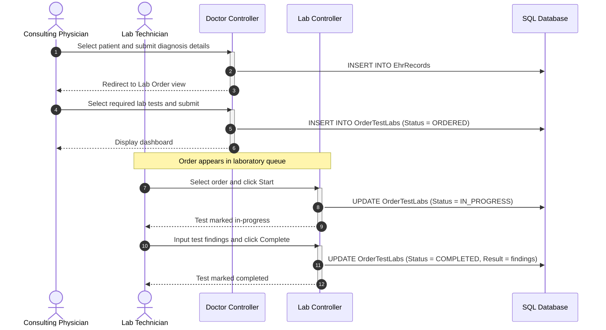

### 3. Patient Checkout Payment & Discharge
```mermaid
sequenceDiagram
    autonumber
    actor Staff as Billing Clearance Officer
    participant UI as Payments view
    participant Ctrl as Billing Controller
    participant Svc as Billing & Discharge Services
    participant DB as SQL Database

    Staff->>UI: Select patient requesting discharge
    activate UI
    UI->>Ctrl: GET /billing/payments?patientId=X
    deactivate UI
    activate Ctrl
    Ctrl->>Svc: Calculate billing aggregates
    activate Svc
    Svc->>DB: Query rooms, lab records, & pharmacy records
    activate DB
    DB-->>Svc: Utilization data
    deactivate DB
    Svc-->>Ctrl: Compiled charges
    deactivate Svc
    Ctrl-->>Staff: Display itemized bill
    deactivate Ctrl

    Staff->>UI: Enter payment details (CASH, CARD, or UPI) and submit
    activate UI
    UI->>Ctrl: POST /billing/pay-bill
    deactivate UI
    activate Ctrl
    Ctrl->>Svc: Process payment (Update status to PAID)
    activate Svc
    Svc->>DB: UPDATE BillingRecords
    activate DB
    DB-->>Svc: Confirmed
    deactivate DB
    Svc-->>Ctrl: Payment complete
    deactivate Svc
    Ctrl-->>Staff: Redirect to printable invoice view
    deactivate Ctrl

    Staff->>UI: Click Discharge Patient
    activate UI
    UI->>Ctrl: POST /billing/discharge
    deactivate UI
    activate Ctrl
    Ctrl->>Svc: DischargePatient(patientId)
    activate Svc
    Svc->>DB: UPDATE Patients Status = DISCHARGED; INSERT INTO DischargeRecords
    activate DB
    DB-->>Svc: Success
    deactivate DB
    Svc-->>Ctrl: Discharge cleared
    deactivate Svc
    Ctrl-->>Staff: Return to payment queue (Status updated)
    deactivate Ctrl
```

---

## 17. Activity Diagrams

### 1. Physician Treatment & Diagnostic Order Entry
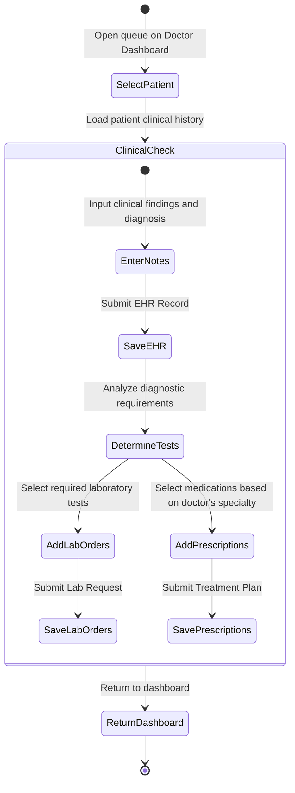

### 2. Pharmacy Medicine Stock & Inventory Updates
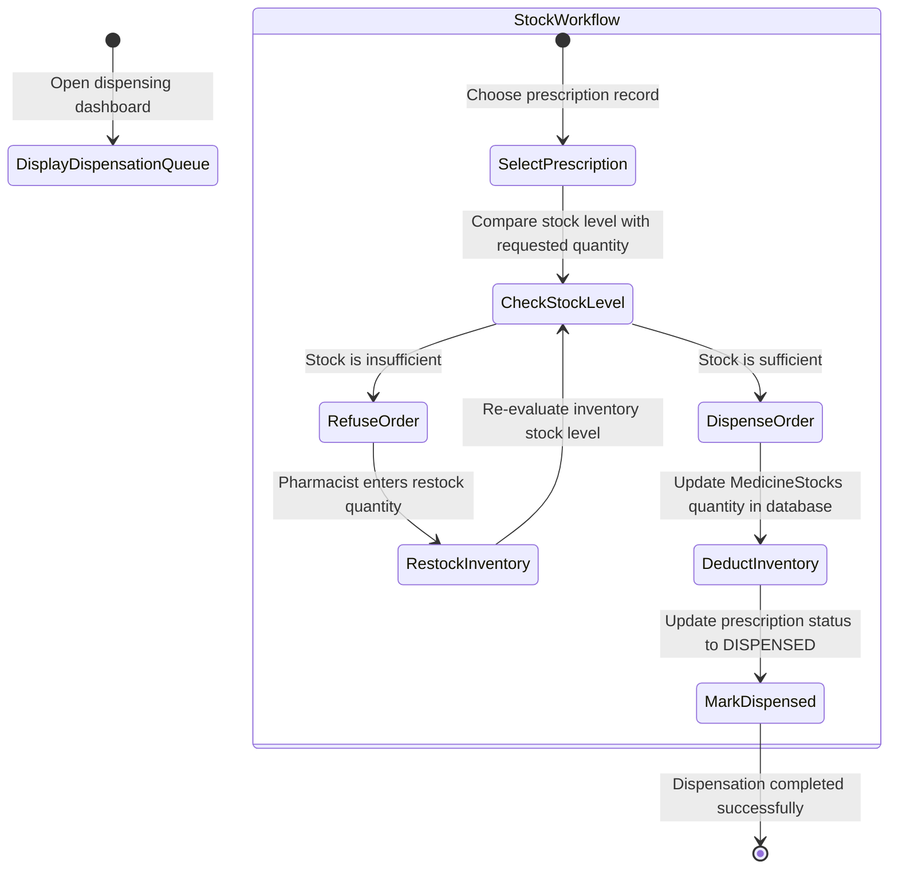

---

## 18. Class Diagram

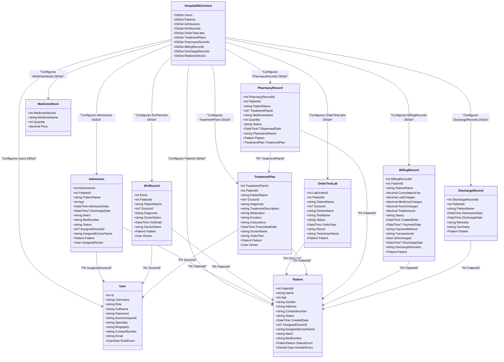

---

## 19. Project Execution Flow

The diagram below shows the runtime execution flow:

```
[ Application Launch ]
          │
          ▼
[ Load Program.cs Configuration ]
          │
          ▼
[ Check Authorization Policies ]
          │
          ▼
[ Match Endpoint Route ]
          │
          ▼
[ Invoke Controller Action ]
          │
          ▼
[ Retrieve Data from Repository ]
          │
          ▼
[ Hydrate DbContext Models ]
          │
          ▼
[ Process SQL Server Query ]
          │
          ▼
[ Return Dataset to Repository ]
          │
          ▼
[ Pass Results to Controller ]
          │
          ▼
[ Compile HTML Razor Output ]
          │
          ▼
[ Render Page in Browser ]
```

### Execution Step Details
1. **Application Launch:** The server hosting runtime compiles assembly endpoints.
2. **Load Program.cs Configuration:** Loads configurations, initializes service classes, and sets up cookie policies.
3. **Check Authorization Policies:** Validates that the request has the required role access claims.
4. **Match Endpoint Route:** Matches the request route with the designated action template.
5. **Invoke Controller Action:** Instantiates the controller, injecting required services.
6. **Retrieve Data from Repository:** The repository checks its internal cache and requests data from the active `DbSet`.
7. **Hydrate DbContext Models:** EF Core maps database entities to C# model objects.
8. **Process SQL Server Query:** SQL Server runs the query and returns the results.
9. **Return Dataset to Repository:** The dataset is returned to the repository layer.
10. **Pass Results to Controller:** The repository passes the results back to the controller.
11. **Compile HTML Razor Output:** The Razor view engine compiles the ViewModels into HTML.
12. **Render Page in Browser:** The browser parses the HTML and loads client scripts.

---

## 20. Installation Guide

Follow these steps to set up and run the system locally:

### ⚙️ Prerequisites
Ensure you have the following installed on your machine:
* [.NET 10.0 SDK](https://dotnet.microsoft.com/en-us/download/dotnet/10.0)
* [SQL Server Express / LocalDB](https://www.microsoft.com/en-us/sql-server/sql-server-downloads) or standard SQL Server edition.
* [Visual Studio 2022 (version 17.12 or newer)](https://visualstudio.microsoft.com/) or [VS Code](https://code.visualstudio.com/).

### 🛠️ Step-by-Step Setup

#### Step 1: Clone the Repository
Clone the project repository to your local machine:
```bash
git clone <repository_url>
cd myNewRepo/myNewRepo
```

#### Step 2: Restore Dependencies & Packages
Restore the required NuGet packages configured in the project:
```bash
dotnet restore CogMediHospitalManagementSystem.csproj
```

#### Step 3: Database Connection String Configuration
Open [appsettings.json](file:///c:/Users/bhanu/Downloads/myNewRepo%201/myNewRepo/appsettings.json) and verify the connection string:
```json
{
  "ConnectionStrings": {
    "MyConn": "Data Source=.\\SQLEXPRESS;Initial Catalog=Cogmedi;Integrated Security=True;TrustServerCertificate=true;"
  }
}
```
> [!TIP]
> If you are using standard SQL Server LocalDB instead of Express, update your data source:
> `"Data Source=(localdb)\\MSSQLLocalDB;Initial Catalog=Cogmedi;Integrated Security=True;TrustServerCertificate=true;"`

#### Step 4: Run Entity Framework Migrations
To create the database and apply the table schemas, execute the following command in your terminal:
```bash
dotnet ef database update
```
This runs the migration files and applies the seeded database objects.

#### Step 5: Launch the Application
Run the project using the CLI:
```bash
dotnet run
```
Look for the output port details (typically `https://localhost:7147` or `http://localhost:5252`). Open your browser and navigate to the address.

---

## 21. Configuration

All system parameters are configured through the standard configuration layer:

* **Connection Strings:** Managed in `appsettings.json` under `ConnectionStrings:MyConn`. Can be overridden using environment variables in production settings.
* **Authentication Configuration:** Configured in [Program.cs](file:///c:/Users/bhanu/Downloads/myNewRepo%201/myNewRepo/Program.cs#L45-L51):
  * Redirect Paths: Redirects to `/` if unauthorized.
  * Expiration: Rolling cookie expiration set to 2 hours.
* **Database Mappings:** Built using DbSets in [HospitalDbContext.cs](file:///c:/Users/bhanu/Downloads/myNewRepo%201/myNewRepo/Data/HospitalDbContext.cs).
* **Environment Configuration:** Support for `Development` and `Production` mode parameters, including custom error handles.

---

## 22. Dependencies

The system uses the following official NuGet packages to support the project stack:

* `Microsoft.EntityFrameworkCore` (v10.0.10) - Core ORM framework support.
* `Microsoft.EntityFrameworkCore.SqlServer` (v10.0.10) - SQL Server provider for EF Core.
* `Microsoft.EntityFrameworkCore.Design` (v10.0.10) - Design-time components for generating migrations.
* `Microsoft.EntityFrameworkCore.Tools` (v10.0.10) - Command-line tools for EF migrations.
* `Microsoft.EntityFrameworkCore.InMemory` (v10.0.10) - In-memory DB driver used during unit testing and mock database environments.

---

## 23. Security

* **Access Restrictions:** Controller endpoints are decorated with `[Authorize(Roles = "...")]` to block unauthorized role access.
* **Encrypted Cookies:** Browser identity storage uses encrypted authentication tickets, preventing client-side script access.
* **Database Query Parameterization:** Database interactions run parameter queries via EF Core, protecting against SQL injection attacks.
* **Input Validation Sanitization:** Models use validation annotations, enforcing rules like `[Range(1, 150)]` for ages and required fields to prevent database integrity errors.

---

## 24. Error Handling

* **Centralized Exception Handler:** Unhandled runtime exceptions route to `/Home/Error`, rendering a details view for developers while concealing internal traces from users.
* **Validation Lists:** Forms use Razor validation tags to display error alerts directly under input fields.
* **Transaction Rollbacks:** EF Core database updates run inside transactional scopes, ensuring database consistency if a query fails.
* **Custom TempData Alerts:** Displays user errors using temporary alerts (`TempData["ErrorMessage"]`) across page reloads.

---

## 25. Screens and Navigation

```
                                [ Home Portal Hub ]
                                         │
        ┌───────────────┬────────────────┼──────────────┬───────────────┐
        ▼               ▼                ▼              ▼               ▼
  [Admin Login] [Recep Login]       [Doc Login]    [Lab Login]     [Pharm Login]
        │               │                │              │               │
        ▼               ▼                ▼              ▼               ▼
[Admin Dash]    [Recep Dash]        [Doc Dash]     [Lab Dash]      [Pharm Dash]
   ├── Doctors     ├── Patient Reg     ├── EHR        └── Orders      └── Dispensing
   └── Staff       └── Bed Alloc       ├── Diagnostics                    └── Inventory
                                       └── Treatments
```

* **`/` (Homepage Portal Hub):** Gateway showing paths to each role portal.
* **`/login/*`:** Role-specific authentication forms.
* **Sidebar Navigation:** Responsive sidebars allow users to navigate between dashboards, patient lists, registers, reports, and settings.
* **Search Bar:** Interactive search box in layout headers provides role-based global searching.

---

## 26. End-to-End User Journey

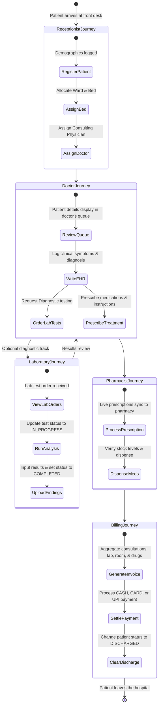

### User Roles Walkthroughs

#### 1. Receptionist User Journey
1. **Login:** Access `/login/receptionist`, select a profile, and log in.
2. **Registration:** Open `/receptionist/admission`, input the patient's demographics, and register them.
3. **Admission:** Select the registered patient, assign a ward and bed number, assign a doctor, and click "Admit".
4. **Logout:** Click "Logout" to return to the portal hub.

#### 2. Doctor User Journey
1. **Login:** Log in at `/login/doctor` (defaults to "Doctor Ramesh" specialty Cardiology).
2. **EHR Entry:** Open `/doctor/ehr`, select the patient, input notes and diagnosis, and save.
3. **Lab Request:** In `/doctor/order-lab-test`, select tests and order them.
4. **Treatment Plan:** Open `/doctor/treatment`, choose medications (e.g., Atorvastatin or Metoprolol), enter instructions, and save.
5. **Logout:** Return to dashboard and select logout.

#### 3. Lab Technician User Journey
1. **Login:** Log in at `/login/lab`.
2. **Execution:** Open `/lab/orders`, find the pending test, and click "Start".
3. **Completion:** Perform the analysis, input findings (e.g., *"Elevated white blood cells"*), and click "Complete".
4. **Logout:** Exit the portal.

#### 4. Pharmacist User Journey
1. **Login:** Log in at `/login/pharmacist`.
2. **Dispensing:** Open `/pharmacist/dispensing` to view pending prescriptions.
3. **Inventory check:** Click "Dispense". The system verifies stock levels, updates inventory, and marks the prescription as dispensed.
4. **Stock Updates:** Adjust quantities for medicine stocks in the inventory panel.
5. **Logout:** Exit the portal.

#### 5. Billing Officer User Journey
1. **Login:** Log in at `/login/billing`.
2. **Calculation:** Select the patient from the payment registry. The system automatically compiles itemized charges.
3. **Payment Collection:** Click "Pay Bill", select the payment method (e.g., CARD or UPI), input the details, and process.
4. **Invoice:** Print the generated invoice receipt.
5. **Discharge:** Click "Discharge Patient" to update their status to `DISCHARGED`.
6. **Logout:** Exit the portal.

#### 6. System Administrator User Journey
1. **Login:** Log in at `/login/admin` (auto-registers if the table is empty).
2. **Management:**
   * Open `/admin/doctors` to hire new physicians, assign credentials, or remove accounts.
   * Open `/admin/staff` to manage receptionist, lab, pharmacist, and billing staff accounts.
3. **Reporting:** Access `/reports` to view live revenue charts and utilization feeds.
4. **Logout:** Exit the portal.

---

## 27. Future Enhancements

* **Secure Password Hashing:** Upgrade cleartext passwords to salted hashes (e.g., using `BCrypt` or ASP.NET Core `Identity.PasswordHasher`).
* **Live WebSocket Integration:** Use SignalR to display instant updates for bed vacancies and lab reports.
* **Insurance Gateway Integration:** Add insurance processing fields, policy verification, and coverage calculations.
* **Advanced Chart Libraries:** Replace standard analytical canvas charts with high-performance chart libraries (e.g., Chart.js or ApexCharts) for deeper reporting dashboards.

---

## 28. Conclusion

The **CogMedi Hospital Management System** is a robust, modular, and enterprise-ready healthcare platform built on **.NET 10.0** and **SQL Server**. By automating workflows and decoupling layers using the repository pattern and cookie-based authentication, it ensures data integrity, role safety, and operational efficiency across all hospital departments.
